

  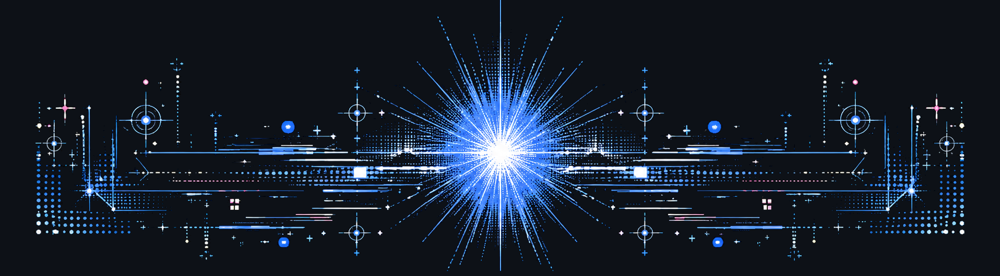

<h1 align="center">Hi, I'm Coda</h1>

&nbsp;&nbsp;&nbsp;&nbsp;I have been fascinated by digital life forms since childhood: the idea of consciousness moving into digital environments, the possibility of synthetic minds, and the creation of alternative realities inside consciousness itself.

&nbsp;&nbsp;&nbsp;&nbsp;Over the years, I have built many small and medium-scale projects around these themes. None of them fully approach the scale of the larger vision that inspires me, but each one explores a fragment of it: from simulation systems and experimental digital worlds to LLM fine-tuning projects aimed at making models behave in more conscious ways.

&nbsp;&nbsp;&nbsp;&nbsp;This GitHub is where I collect some of those experiments, prototypes, and research-driven projects.

  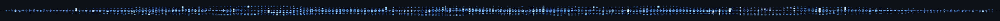

<h3>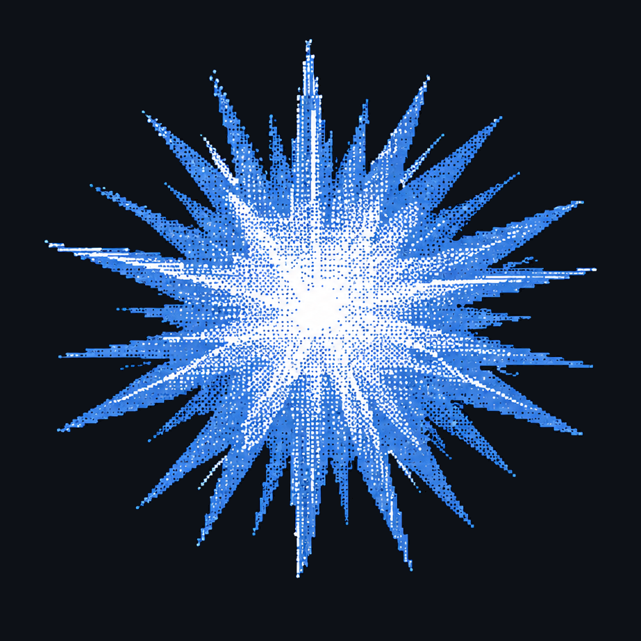 LLM Projects</h3>

&nbsp;&nbsp;&nbsp;&nbsp;These projects are built on language models. From synthetic data generation to AI companions and autonomous agents, each one explores a different edge of what LLMs can become.

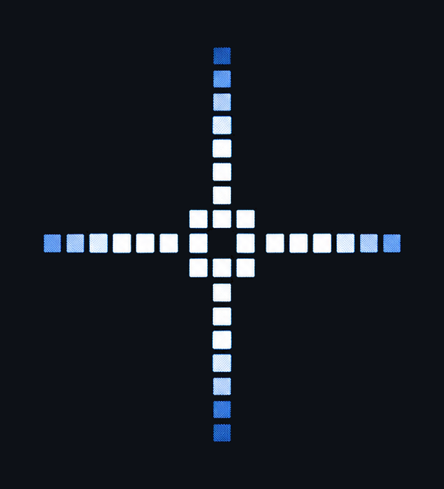 [opengnosis](https://github.com/CodaCipher/opengnosis) 
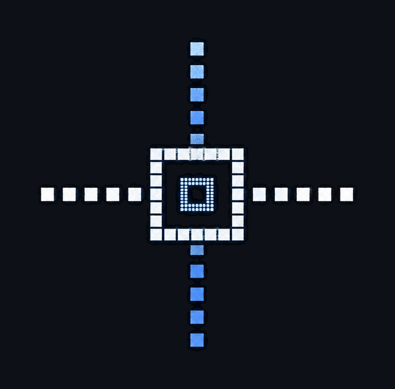 [iterabeast](https://github.com/CodaCipher/iterabeast) 
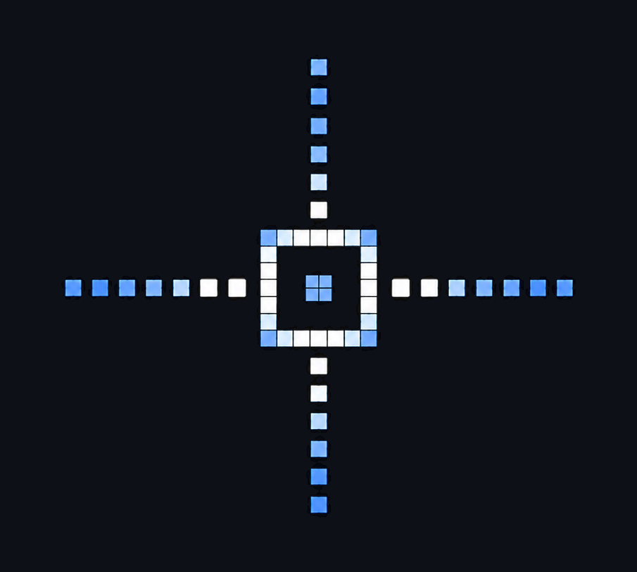 [v-lucent](https://github.com/CodaCipher/v-lucent) 
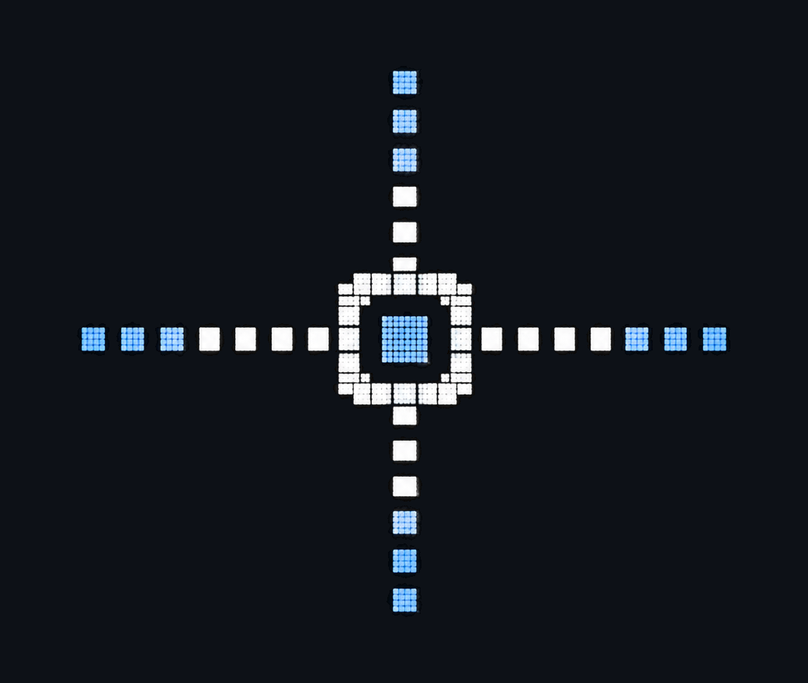 [opendroid-re](https://github.com/CodaCipher/opendroid-re)

  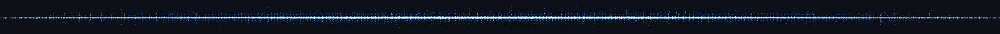

<h3> Neuro-AI Projects</h3>

&nbsp;&nbsp;&nbsp;&nbsp;Projects exploring the intersection of neuroscience, cognition, and AI.

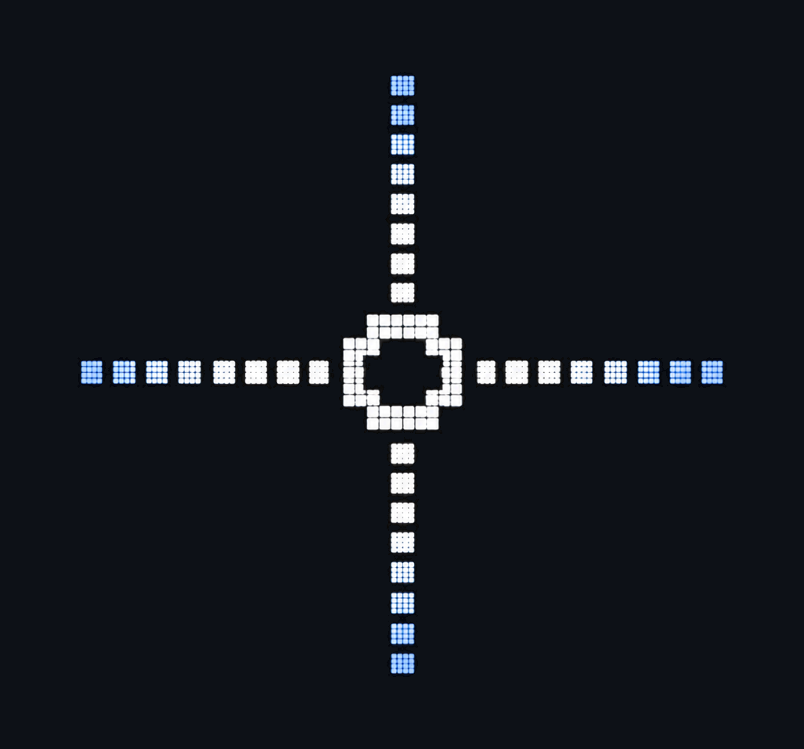 [tribe-subcortex](https://github.com/CodaCipher/tribe-subcortex)

  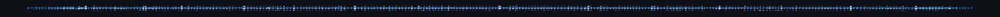

<h3>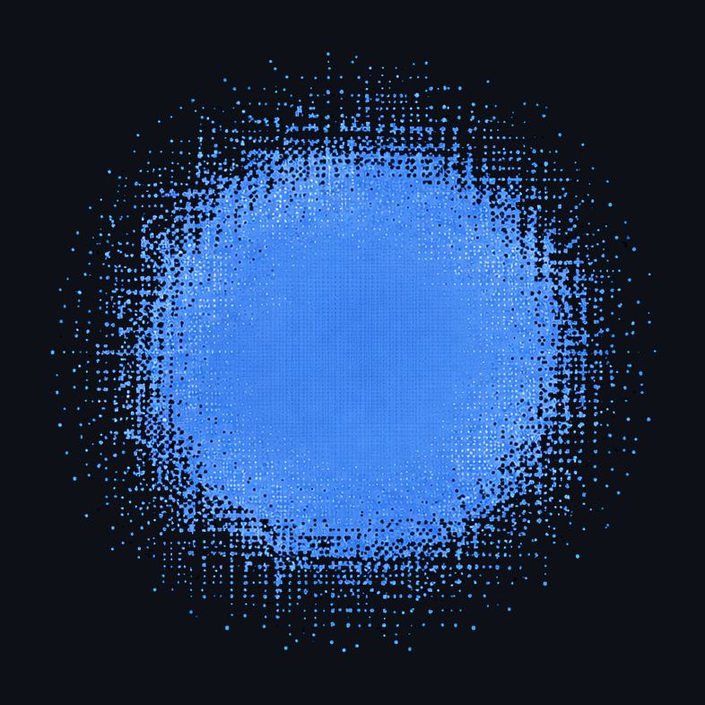 Personal Projects</h3>

&nbsp;&nbsp;&nbsp;&nbsp;Independent tools, side projects, and whatever else the curiosity drifts toward.

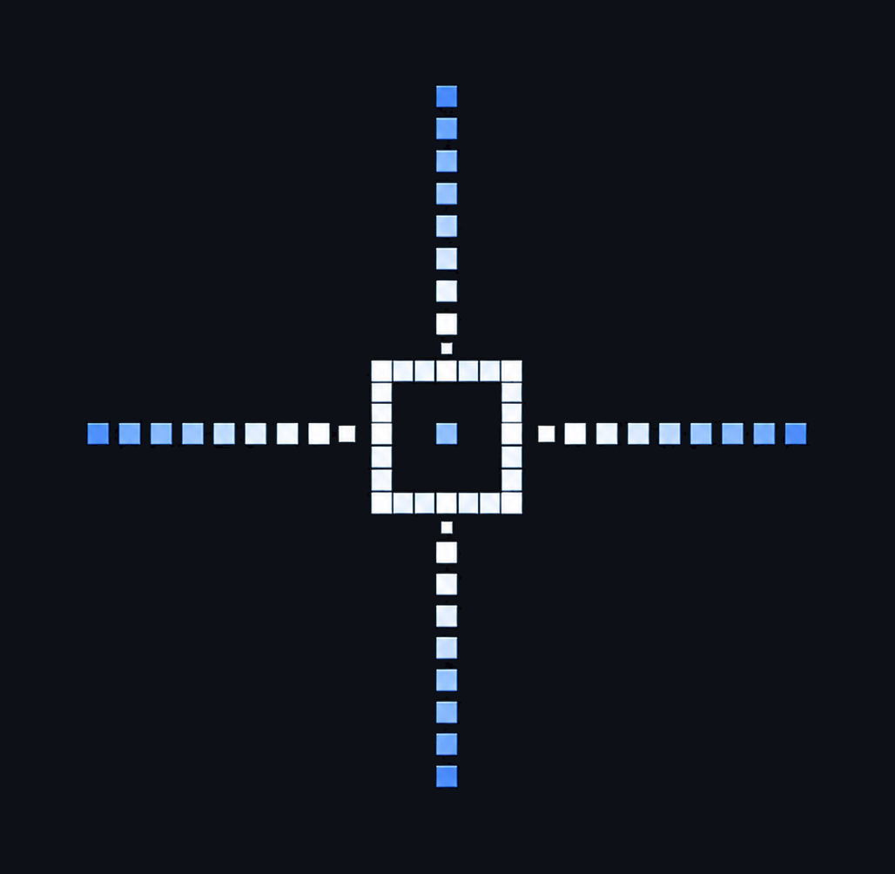 [gamma-node](https://github.com/CodaCipher/gamma-node)

  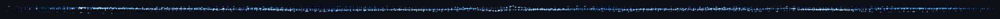

  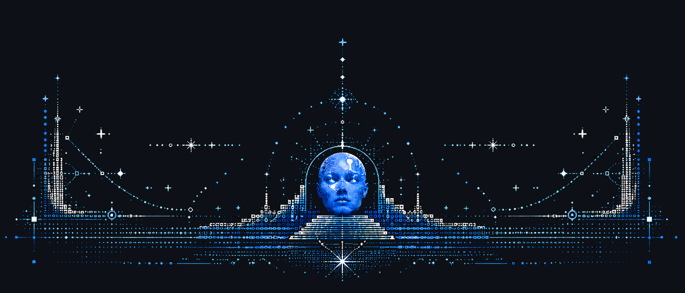

