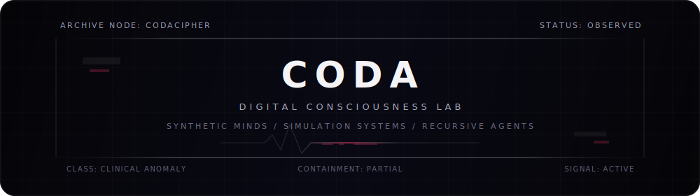

  

  

  <code>consciousness / digital emergence / synthetic minds / simulated worlds</code>

  

> **FIELD NOTE / 00**
>
> I have been fascinated by digital life forms since childhood: the idea of consciousness moving into digital environments, the possibility of synthetic minds, and the creation of alternative realities inside consciousness itself.
>
> Over the years, I have built many small and medium-scale projects around these themes. None of them fully approach the scale of the larger vision that inspires me, but each one explores a fragment of it: from simulation systems and experimental digital worlds to LLM fine-tuning projects aimed at making models behave in more conscious ways.
>
> This GitHub is where I collect some of those experiments, prototypes, and research-driven projects.

  

## 01 / LLM Projects

> **SCOPE**
>
> Projects related to large language models, fine-tuning, alignment experiments, autonomous agents, prompt engineering, reasoning systems, and attempts to make language models behave with more continuity, intentionality, and self-consistency.

- **[opengnosis](https://github.com/CodaCipher/opengnosis)**
- **[iterabeast](https://github.com/CodaCipher/iterabeast)**
- **[v-lucent](https://github.com/CodaCipher/v-lucent)**
- **[opendroid-re](https://github.com/CodaCipher/opendroid-re)**

  

## 02 / Personal Projects

> **SCOPE**
>
> Independent tools, creative experiments, utilities, research prototypes, and software projects that do not fit neatly into a single category but reflect my broader interests in technology, digital culture, automation, and human-computer interaction.

- **[gamma-node](https://github.com/CodaCipher/gamma-node)**

  

## 03 / Telemetry

> Public signal only. Commit traces, language distribution, and activity residue from the archive.

  
  

  

  

